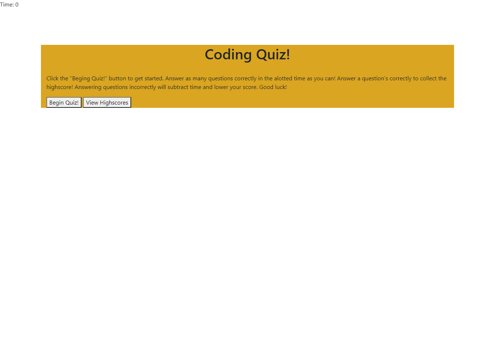

# 04 Coding Quiz #
## User Story ##
* This project enabled me to better understand the DOM
* I learned how information can be stored about a webpage using local storage
* On click events make a lot more sense to me now
* I had never thought of attaching functions to "events" prior to this assignment
## Features ##
* Click Begin Quiz! to get started!
* Answer all questions to log a high score
* buttons to navigate to high score page and buttons to navigate back to start page
* My high scores page is on the same HTML page as my quiz, which is different than majority of the class. I chose to do this for an extra challenge.
* The end screen where you can submit your score, appears different than the high score screen. Did this using display none and navigating the DOM
## Installation ##
1. Open up git bash terminal
2. Change directory to desired location (%User Profile%/SourceRepo)
3. Clone the repository (git clone git@github.com:ChristianGoldman/Coding-Quiz.git)
## Usage ##
1. Open index.html in browser.
2. Should see a page like this.

## Credits ##
* Cwerness gitlab
* https://www.w3schools.com/js/default.asp
* https://validator.w3.org/
* https://www.youtube.com/watch?v=49pYIMygIcU&t=369s
* https://www.w3schools.com/js/js_json.asp
* BCA learning assistants
* TA's paul hendrickson and Tommy Boone
## Link to deployed application ##
* https://christiangoldman.github.io/Coding-Quiz/
## License ##
    MIT License

    Copyright (c) [2020] [Christian Goldman]

    Permission is hereby granted, free of charge, to any person obtaining a copy
    of this software and associated documentation files (the "Software"), to deal
    in the Software without restriction, including without limitation the rights
    to use, copy, modify, merge, publish, distribute, sublicense, and/or sell
    copies of the Software, and to permit persons to whom the Software is
    furnished to do so, subject to the following conditions:

    The above copyright notice and this permission notice shall be included in all
    copies or substantial portions of the Software.

    THE SOFTWARE IS PROVIDED "AS IS", WITHOUT WARRANTY OF ANY KIND, EXPRESS OR
    IMPLIED, INCLUDING BUT NOT LIMITED TO THE WARRANTIES OF MERCHANTABILITY,
    FITNESS FOR A PARTICULAR PURPOSE AND NONINFRINGEMENT. IN NO EVENT SHALL THE
    AUTHORS OR COPYRIGHT HOLDERS BE LIABLE FOR ANY CLAIM, DAMAGES OR OTHER
    LIABILITY, WHETHER IN AN ACTION OF CONTRACT, TORT OR OTHERWISE, ARISING FROM,
    OUT OF OR IN CONNECTION WITH THE SOFTWARE OR THE USE OR OTHER DEALINGS IN THE
    SOFTWARE.